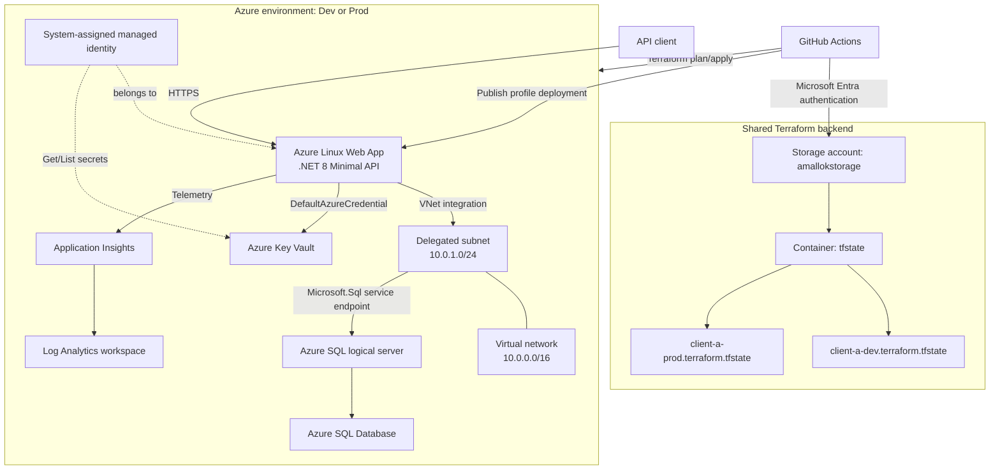
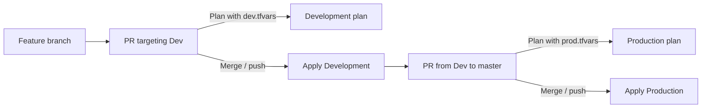

# Client A Azure Architecture

## 1. Overview

This repository contains a .NET 8 Minimal API and Terraform configuration for deploying independent Development and Production environments to Microsoft Azure.

The solution uses:

- Azure App Service on Linux to host the API.
- Azure SQL Database for product data.
- Microsoft Entra ID and managed identities for passwordless Azure authentication.
- Azure Key Vault for application secret access.
- Application Insights and Log Analytics for Azure observability.
- Azure Virtual Network integration and a Microsoft SQL service endpoint.
- GitHub Actions for infrastructure and application delivery.
- Azure Blob Storage as the remote Terraform backend.

## 2. High-level architecture



## 3. Environment model

The same Terraform configuration creates both environments. Environment-specific values and state are kept separate.

| Concern | Development | Production |
|---|---|---|
| Git branch | `Dev` | `master` |
| GitHub Environment | `Development` | `Production` |
| Variable file | `terraformLearn/dev.tfvars` | `terraformLearn/prod.tfvars` |
| Resource group | `rg-client-a-dev` | `rg-client-a-prod` |
| Terraform state key | `client-a-dev.terraform.tfstate` | `client-a-prod.terraform.tfstate` |
| Name suffix | `dev` | `prod` |

Both states are stored in the same backend storage account and container. Different state keys prevent Terraform from confusing Development resources with Production resources.

## 4. Azure components

### Resource group

Each environment has its own resource group:

- `rg-client-a-dev`
- `rg-client-a-prod`

All workload resources for an environment are placed inside its resource group.

### Application hosting

An `azurerm_service_plan` provides a Linux `B1` App Service plan:

```text
app-plan-{environment}
```

An `azurerm_linux_web_app` hosts the .NET 8 API:

```text
app-client-a-dotnet-api-{environment}
```

The Web App has:

- .NET 8 runtime configuration.
- A system-assigned managed identity.
- Regional VNet integration through the delegated subnet.
- Application settings for Key Vault, Azure SQL, and Application Insights.

### Networking

The reusable `terraformLearn/modules/azure_network` module creates:

- VNet: `vnet-client-a-{environment}`
- Address space: `10.0.0.0/16`
- Subnet: `snet-backend-{environment}`
- Subnet range: `10.0.1.0/24`

The subnet is delegated to `Microsoft.Web/serverFarms` for App Service VNet integration and has a `Microsoft.Sql` service endpoint.

The SQL virtual network rule authorizes that subnet:

```text
sql-vnet-rule-{environment}
```

A separate SQL firewall rule currently permits the configured local public IP:

```text
Local-Access-{environment}
```

### Data platform

Each environment contains:

- SQL logical server: `sqlserver-client-a-{environment}`
- SQL database: `sqldb-client-a-{environment}`
- Database SKU: `Basic`

The logical server uses Microsoft Entra-only authentication:

```hcl
azuread_authentication_only = true
```

The application connection string uses:

```text
Authentication=Active Directory Default
```

This avoids storing a SQL administrator password in the application configuration.

### Key Vault

Each environment creates a Key Vault with a globally unique random suffix:

```text
kv-client-a-{random-suffix}
```

Access policies grant:

- The Terraform execution identity permission to manage secrets.
- The Web App's system-assigned identity permission to `Get` and `List` secrets.

The Web App receives the vault URI through the `KeyVaultUri` application setting. At startup, the API adds Key Vault as a configuration source using `DefaultAzureCredential`.

Key Vault secret names use double hyphens to represent configuration nesting. For example:

```text
ConnectionStrings--DefaultConnection
```

is exposed to .NET as:

```text
ConnectionStrings:DefaultConnection
```

### Monitoring

Each environment creates:

- Log Analytics workspace: `app-analytics-client-a-{environment}`
- Application Insights: `app_insights-client-a-{environment}`

Application Insights is workspace-based and sends its logs and metrics to the Log Analytics workspace.

Terraform injects `APPLICATIONINSIGHTS_CONNECTION_STRING` into the Web App. The API enables Application Insights only when this setting is present, allowing local Docker development to run without Azure telemetry configuration.

## 5. Application architecture

The API is an ASP.NET Core .NET 8 Minimal API using Entity Framework Core 8 and SQL Server.

Current endpoints include:

| Method | Route | Purpose |
|---|---|---|
| `GET` | `/products` | Return all products |
| `POST` | `/products` | Create and persist a product |
| `GET` | `/weatherforecast` | Template/demo endpoint |

The application loads configuration in this order:

1. Standard ASP.NET Core sources such as JSON files and environment variables.
2. Azure Key Vault when `KeyVaultUri` is configured.
3. `DefaultConnection` is read through `builder.Configuration.GetConnectionString("DefaultConnection")`.

Serilog sends logs to:

- Console in all environments.
- Seq using `Seq:ServerUrl`, defaulting to `http://localhost:5341`.

Entity Framework migrations are automatically applied at startup only when `ASPNETCORE_ENVIRONMENT=Development`.

## 6. Local Docker environment

`docker-compose.yml` provides a local development stack:

| Service | Purpose | Port |
|---|---|---|
| `api` | .NET 8 API | `8080` |
| `db` | SQL Server 2022 | `1433` |
| `seq` | Structured log viewer | `5341` |

Docker Compose overrides `ConnectionStrings__DefaultConnection` so the API connects to the local `db` container using SQL authentication. It also configures the API to send Serilog events to the `seq` container.

Passwords are supplied through environment substitution and should be stored in an uncommitted `.env` file.

## 7. Terraform delivery workflow

The Terraform workflow is defined in `.github/workflows/terraform.yml`.

### Branch behavior



For pull requests, the workflow plans against the target environment but does not apply. For pushes to `Dev` or `master`, it plans and then applies.

The workflow runs:

1. `terraform fmt -check -recursive`
2. `terraform init`
3. `terraform validate`
4. `terraform plan`
5. `terraform apply` for push events only

### Backend authentication

The workflow sets:

```yaml
ARM_USE_AZUREAD: "true"
```

This makes the backend use Microsoft Entra authentication rather than retrieving storage account access keys.

The GitHub service principal needs two distinct permissions:

| Scope | Required role | Purpose |
|---|---|---|
| `tfstate` container | Storage Blob Data Contributor | Read, lock, and update Terraform state |
| Azure subscription or target resource groups | Contributor | Create and update workload resources |

## 8. Application delivery workflow

The application workflow is defined in `.github/workflows/deploy.yml`. It runs on pushes to `Dev` and `master`, or by manual dispatch from either of those branches.

The deployment target is selected from the branch:

| Branch | GitHub Environment | Azure Web App |
|---|---|---|
| `Dev` | `Development` | `app-client-a-dotnet-api-dev` |
| `master` | `Production` | `app-client-a-dotnet-api-prod` |

It performs:

1. Source checkout.
2. .NET 8 setup.
3. Unit tests.
4. SonarCloud analysis.
5. Release publishing.
6. Azure Web App deployment using a publish profile.

Required GitHub secrets include:

- `AZURE_WEBAPP_PUBLISH_PROFILE` in both GitHub Environments, containing the corresponding Web App's publish profile
- `SONAR_TOKEN`

## 9. Terraform operations

Run Terraform commands from:

```powershell
cd C:\Users\melek\Documents\Learn\terraformLearn
```

### Select Development state

```powershell
$env:ARM_USE_AZUREAD = "true"

terraform init -reconfigure `
  -backend-config="resource_group_name=rg-terraform-meta" `
  -backend-config="storage_account_name=amallokstorage" `
  -backend-config="container_name=tfstate" `
  -backend-config="key=client-a-dev.terraform.tfstate"
```

### Select Production state

```powershell
$env:ARM_USE_AZUREAD = "true"

terraform init -reconfigure `
  -backend-config="resource_group_name=rg-terraform-meta" `
  -backend-config="storage_account_name=amallokstorage" `
  -backend-config="container_name=tfstate" `
  -backend-config="key=client-a-prod.terraform.tfstate"
```

Always verify the selected state before applying or destroying:

```powershell
terraform state show azurerm_resource_group.rg
```

### Destroy Development

```powershell
terraform plan -destroy -var-file="dev.tfvars"
terraform destroy -var-file="dev.tfvars"
```

The backend storage account is intentionally separate from the workload and is not destroyed by this configuration.

## 10. Security model

- Terraform authenticates with a GitHub service principal through `ARM_*` secrets.
- The remote backend uses Microsoft Entra authorization.
- The Web App uses a system-assigned managed identity.
- Azure SQL accepts Microsoft Entra authentication only.
- Key Vault permissions are explicitly assigned to the application identity.
- Local state, `.terraform/`, `.env`, and development settings are excluded from Git.

## 11. Current limitations and recommended improvements

1. **Publish profiles are less preferred than federated identity.**
   Consider replacing the publish profile with GitHub OpenID Connect and `azure/login`.

2. **Key Vault is connected but Terraform creates no secrets.**
   The API can read Key Vault, but the current database connection string is supplied directly as an App Service setting. Decide whether Key Vault should become the authoritative source and add secrets accordingly.

3. **Azure SQL database authorization is not created by Terraform.**
   A system-assigned Web App identity must also exist as a contained database user and receive the required database roles. The SQL server's Entra-only setting alone does not grant application access.

4. **The local public IP firewall rule exists in Production.**
   Consider creating `azurerm_mssql_firewall_rule.local_access` only for Development.

5. **Network access remains partly public.**
   The SQL service endpoint and VNet rule restrict one path, but the SQL server and Key Vault still have public network access enabled. Private endpoints would provide stronger isolation.

6. **Subnet address ranges are identical across environments.**
   This is acceptable while VNets remain isolated, but distinct ranges are preferable if Dev and Prod networks may later be peered.

7. **Production should use stronger safeguards.**
    Consider GitHub Environment approval rules, Terraform plan approval, resource locks, diagnostic settings, backup/retention review, and a higher SQL/App Service SKU based on availability requirements.

## 12. Important repository files

| File | Responsibility |
|---|---|
| `terraformLearn/main.tf` | Azure workload resources |
| `terraformLearn/variables.tf` | Root Terraform inputs |
| `terraformLearn/dev.tfvars` | Development values |
| `terraformLearn/prod.tfvars` | Production values |
| `terraformLearn/modules/azure_network/` | VNet and subnet module |
| `.github/workflows/terraform.yml` | Infrastructure CI/CD |
| `.github/workflows/deploy.yml` | API build, quality checks, and deployment |
| `webApiLearn/ClientA.Api/Program.cs` | API composition and configuration |
| `webApiLearn/ClientA.Api/Dockerfile` | API container image |
| `docker-compose.yml` | Local API, SQL Server, and Seq stack |
